# 小红书笔记生成器 (XHS Note Generator)

🎥 一键将视频转换为优质小红书笔记，自动优化内容和配图


## 👤 作者信息

- **作者**：玄清
- **博客**：[天天悦读](https://blog.example.com)
- **Email**：grow8org@gmail.com
- **GitHub**：[whotto/Video_note_generator](https://github.com/whotto/Video_note_generator)

## 🎯 应用场景

- **内容创作者**：快速将视频/直播内容转换为文章
- **知识管理者**：自动整理视频笔记和学习要点
- **社交媒体运营**：批量生成优质小红书笔记

## ✨ 小红书笔记特点

- **标题创作**：
  - 使用二极管标题法，抓住用户痛点
  - 融入高转化词和情感词
  - 添加2-4个相关表情
  - 控制在20字以内

- **内容优化**：
  - 正文控制在600-800字
  - 每段使用emoji引导
  - 设置2-3处互动引导
  - 加入个人经验和共情描述
  - 自动获取相关配图

- **标签系统**：
  - 核心关键词
  - 关联长尾词
  - 高转化标签
  - 热门话题标签

## 🔄 创作流程

```mermaid
graph TD
    A[视频URL] --> B[下载视频]
    B --> C[提取音频]
    C --> D[Whisper转录]
    D --> E[AI长文整理]
    E --> F[小红书风格优化]
    F --> G[生成标题]
    F --> H[生成标签]
    F --> I[获取配图]
    G & H & I --> J[生成最终笔记]
```



## 🚀 使用方式

支持三种使用方式：

1. **处理单个视频**：
```bash
python video_note_generator.py https://example.com/video
```

2. **批量处理 URL 文件**：
```bash
# urls.txt 文件，每行一个视频链接
python video_note_generator.py urls.txt
```

3. **处理 Markdown 文件**：
```bash
# 支持 Markdown 链接和直接 URL
python video_note_generator.py notes.md
```

## 🛠️ 使用工具

- [FFmpeg](https://ffmpeg.org/) - 音视频转换
- [Whisper](https://github.com/openai/whisper) - 语音转文字
- [OpenRouter](https://openrouter.ai/) - AI 内容优化
- [Unsplash](https://unsplash.com/) - 高质量图片

## 📦 快速开始

### 1. 安装依赖

```bash
# 安装 FFmpeg
# Mac: brew install ffmpeg
# Windows: 从 ffmpeg.org 下载并添加到环境变量
# Linux: apt install ffmpeg

# 安装 Python 依赖
pip install -r requirements.txt

# 配置环境变量
cp .env.example .env
```

### 2. 配置 API 密钥

编辑 `.env` 文件，填入必要的 API 密钥：
```ini
# OpenRouter API（必需）
OPENROUTER_API_KEY=your-api-key-here

# Unsplash API（必需）
UNSPLASH_ACCESS_KEY=your-unsplash-access-key-here
UNSPLASH_SECRET_KEY=your-unsplash-secret-key-here
```

### 3. 开始使用

1. 创建 `urls.txt` 文件，每行一个视频链接
2. 运行环境检查：
```bash
python check_environment.py
```
3. 运行生成器：
```bash
python video_note_generator.py test.md
```

## 📄 输出文件

每个视频会生成三个文件：

1. **原始笔记** (`YYYYMMDD_HHMMSS.md`)：
   - 完整的视频转录文本
   - 保留所有细节内容

2. **整理版笔记** (`YYYYMMDD_HHMMSS_organized.md`)：
   - AI优化后的结构化内容
   - 重点内容突出
   - 段落优化

3. **小红书版本** (`YYYYMMDD_HHMMSS_xiaohongshu.md`)：
   - 优化的爆款标题
   - 600-800字精华内容
   - 2-3张相关配图
   - 优化的标签系统
   - 互动引导设计

## ⚙️ 配置说明

在 `.env` 文件中可以调整以下参数：

```ini
# 内容生成配置
MAX_TOKENS=2000          # 生成小红书内容的最大长度
CONTENT_CHUNK_SIZE=2000  # 长文本分块大小（字符数）
TEMPERATURE=0.7          # AI 创造性程度 (0.0-1.0)

# 代理设置（可选）
# HTTP_PROXY=http://127.0.0.1:7890
# HTTPS_PROXY=http://127.0.0.1:7890
```

## 📄 许可证

MIT License

## 🙏 鸣谢

感谢以下开源项目：
- [Whisper](https://github.com/openai/whisper)
- [FFmpeg](https://ffmpeg.org/)
